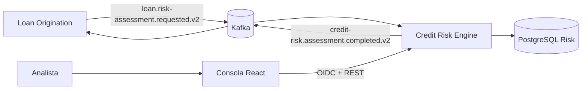

# Credit Risk Engine

Servicio independiente que evalúa elegibilidad, asequibilidad y riesgo de una solicitud personal usando información declarada. Produce APPROVE, REFER o REJECT con explicación persistida; no origina ofertas ni reemplaza un bureau/FICO.

## Ecosistema

Loan Origination posee solicitud y workflow. Credit Risk pregunta si el perfil declarado satisface una política. Fraud Detection evalúa comportamiento sospechoso. Los bounded contexts mantienen reglas y bases separadas.



## Arquitectura y política

Clean Architecture: domain sin framework, application y ports, adapters REST/Kafka/persistencia; Quarkus conecta infraestructura. Flyway gestiona schema; Hibernate valida.

Policy personal-loan-ar 2.0.0. Entrada: PERSONAL_LOAN, capital, ARS, plazo, ingreso/deuda mensual declarados, empleo/antigüedad. No incluye nombre, email, subject OIDC ni bureau. Elegibilidad: ARS 100.000–10.000.000, plazo 6–60 meses, ingreso ≥ ARS 100.000. Invalid request produce error.

Cuota referencial usa sistema francés y tasa nominal anual de estrés 48% (mensual 48/1200); no es oferta de LO. DTI actual=deuda/ingreso; proyectado=(deuda+cuota)/ingreso; disponible=ingreso−deuda−cuota. BigDecimal, dinero 2 decimales, DTI 4. DTI proyectado >60% o disponible ≤0 fuerza REJECT.

Score parte de 700, acotado 300–850; factores explicables: DTI, ingreso disponible, empleo/antigüedad, capital/ingreso y plazo.

| Banda |   Score |
| ----- | ------: |
| A     | 780–850 |
| B     | 700–779 |
| C     | 620–699 |
| D     | 540–619 |
| E     | 300–539 |

APPROVE exige score ≥700, banda A/B, DTI proyectado ≤35%, disponible ≥ cuota y empleo estable (permanente ≥6 meses o independiente ≥36). Si no, REFER si score ≥520, DTI ≤55%, disponible >0; resto REJECT. Los umbrales son demostrativos, no underwriting bancario.

## API, roles y consola

Rutas protegidas por RISK_ANALYST o ADMIN:

| Método | Endpoint                      | Uso                         |
| ------ | ----------------------------- | --------------------------- |
| POST   | /api/v1/risk-assessments      | Evaluar y persistir         |
| GET    | /api/v1/risk-assessments      | Historial paginado/filtrado |
| GET    | /api/v1/risk-assessments/{id} | Detalle explicable          |

Filtros: page desde cero, size máximo 100, decision, riskBand, loanApplicationId, assessmentRequestId, policyVersion. SPA: /login, /assessments, /assessments/:id. La consola lee y explora; no cambia solicitudes LO.

Keycloak Dev Services importa realm credit-risk, cliente público credit-risk-analyst/PKCE. analyst/analyst (RISK_ANALYST), admin/admin (ADMIN), sólo dev.

## Kafka y fiabilidad

| Topic                                 | Productor → consumidor             | Propósito               |
| ------------------------------------- | ---------------------------------- | ----------------------- |
| loan.risk-assessment.requested.v2     | LO → CRE, group credit-risk-engine | Solicitud               |
| credit-risk.assessment.completed.v2   | CRE → LO                           | Resultado               |
| loan.risk-assessment.requested.v2.DLQ | Consumer CRE                       | Solicitud no procesable |

El canal activo es v2; contratos v1 en docs son históricos. assessmentRequestId es idempotencia persistente: misma entrada reproduce, contenido distinto conflictúa. Assessment y outbox se guardan atómicamente; publisher entrega después con semántica at-least-once. LO deduplica por ID estable. Correlation ID acompaña el mensaje. Kafka apagado por defecto; activar RISK_KAFKA_ENABLED=true en ambos servicios.

## Desarrollo local

|  API | PostgreSQL | Keycloak | Vite | Kafka |
| ---: | ---------: | -------: | ---: | ----: |
| 8082 |       5434 |     8181 | 5174 | 29092 |

Vite 5174 evita colisión con LO 5173; Keycloak permite ese redirect/origin. El default CORS del backend coincide con el origen local http://localhost:5174; FRONTEND_ORIGIN permite configurarlo para otros entornos. Requisitos: JDK25, Docker, Bun.

```powershell
docker compose up -d postgres
$env:DB_JDBC_URL='jdbc:postgresql://localhost:5434/credit_risk'
.\mvnw.cmd quarkus:dev
```

Otra terminal: cd frontend; bun install --frozen-lockfile; bun run dev. Abrir http://localhost:5174. Variables SPA en frontend/.env.example (API8082, issuer8181, realm/client). Producción requiere DB_USERNAME, DB_PASSWORD, DB_JDBC_URL, OIDC_AUTH_SERVER_URL, FRONTEND_ORIGIN, PORT, KAFKA_BOOTSTRAP_SERVERS y OTEL variables; no Dev Services ni usuarios demo.

Health /q/health/live y /ready; métricas /q/metrics; OpenAPI /q/openapi; Swagger /q/swagger-ui. OTel disponible, OTLP opcional; LGTM no se inicia en dev. Flyway aplica migraciones V1–V3 y Hibernate valida. Compose levanta Postgres y Kafka.

```powershell
.\mvnw.cmd test
.\mvnw.cmd spotless:check verify
cd frontend
bun install --frozen-lockfile
bun run build
cd ..
bun install --frozen-lockfile
bun run format:check
```

## Alcance y competencias

No bureau, FICO ni fuentes externas; no verifica veracidad. La cuota 48% es supuesto de estrés. LO conserva autoridad de gates, estado y oferta; Risk persiste explicación/versionado. Demuestra policy determinista, Clean Architecture, BigDecimal/DTI, Java/Quarkus, PostgreSQL/Flyway, Kafka/outbox/DLQ/dedupe, OIDC, React/TS, Spotless y CI.

LICENSE.md: PolyForm Noncommercial 1.0.0, código disponible con restricción comercial; no licencia OSI open source.

| Proyecto                  | Dominio           | Arquitectura      | Responsabilidad        | Integración |
| ------------------------- | ----------------- | ----------------- | ---------------------- | ----------- |
| Loan Origination Platform | Lending           | Hexagonal         | Workflow préstamo      | Kafka       |
| Credit Risk Engine        | Riesgo crediticio | Clean             | Capacidad/eligibilidad | Kafka       |
| Fraud Detection Engine    | Fraude            | Modular por capas | Señales/casos          | Kafka       |
