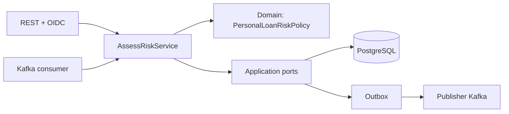

# Backend: política crediticia explicable

## Entrada, resultado y autoridad

Credit Risk recibe una referencia de solicitud y un perfil financiero declarado. Produce una evaluación inmutable con decisión, score, banda, motivos, contribuciones, parámetros y versión de política. No recibe la contraseña del usuario LO ni necesita nombre/email para calcular riesgo.

Loan Origination decide el workflow y emite ofertas. APPROVE en este motor no crea un Loan; REFER no obliga al oficial a aprobar; REJECT es un resultado de la política, no una respuesta HTTP de error.

## Clean Architecture aplicada



El dominio y la política no dependen de Quarkus. Los casos de uso concretos sí usan CDI y límites transaccionales: no se afirma que toda application esté libre de framework. Los puertos separan evaluación de persistencia y publicación.

## Transporte válido no significa elegibilidad

La validación del DTO rechaza estructura o valores inválidos. Una entrada técnicamente válida puede no cumplir personal-loan-ar 2.0.0 y devolver una evaluación REJECT con motivos. La política exige PERSONAL_LOAN, ARS, capital 100.000–10.000.000, 6–60 meses e ingreso mensual al menos 100.000.

Esto evita confundir un 400 por petición mal formada con una decisión crediticia negativa. El fixture de ARS 200 de Loan Origination usa LOCAL_RULES y no prueba estos umbrales.

## Capacidad de pago

La cuota referencial usa sistema francés a TNA de estrés 48%; es un supuesto de evaluación y no la tasa contractual que LO ofrecerá.

```text
cuotaReferencia = sistemaFrancés(capital, TNA 48%, meses)
DTI actual       = deudaMensual / ingresoMensual
DTI proyectado   = (deudaMensual + cuotaReferencia) / ingresoMensual
ingresoDisponible = ingresoMensual - deudaMensual - cuotaReferencia
```

Dinero usa BigDecimal con centavos; DTI se conserva con cuatro decimales. DTI proyectado mayor a 60% o ingreso disponible no positivo fuerza REJECT.

## Score, banda y decisión

Score inicia en 700 y se acota entre 300 y 850. Las contribuciones corresponden a deuda/ingreso, capacidad, empleo y antigüedad, relación capital/ingreso y plazo. La explicación persistida muestra cada aporte y sus reason codes.

| Banda | Intervalo |
|---|---|
| A | 780–850 |
| B | 700–779 |
| C | 620–699 |
| D | 540–619 |
| E | 300–539 |

APPROVE requiere score ≥700, banda A/B, DTI proyectado ≤35%, disponible ≥cuota y empleo estable: permanente ≥6 meses o independiente ≥36. Si no aprueba, REFER requiere score ≥520, DTI ≤55% y disponible positivo; el resto es REJECT, además de los rechazos de elegibilidad/capacidad.

La captura REFER demuestra por qué un 785/A puede requerir revisión: la estabilidad laboral no satisface el gate de aprobación. No es un modelo de ML ni una probabilidad de incumplimiento.

## Snapshot e idempotencia persistente

[AssessRiskService](../src/main/java/com/creditrisk/application/usecase/AssessRiskService.java) busca assessmentRequestId antes de calcular. Una repetición con entrada material igual recupera la evaluación; un ID reutilizado con otros importes, referencias o perfil produce conflicto. Una evaluación antigua sin snapshot comparable tampoco se trata como replay seguro.

La creación de assessment y outbox ocurre en la misma transacción. La explicación se consulta como dato histórico; cambiar la política mañana no recalcula silenciosamente el resultado que aparece en la consola.

## API y seguridad

POST /api/v1/risk-assessments evalúa; GET en colección pagina/filtra; GET /{id} entrega el detalle. RISK_ANALYST y ADMIN son los roles de esta API. El subject OIDC sirve para acceso, no para introducir PII en el evento crediticio.

El frontend React autentica mediante Keycloak/PKCE y muestra datos del backend. FRONTEND_ORIGIN controla CORS. Las variables VITE_* son públicas y no deben contener secretos.

## Kafka, persistencia y operación

Consume loan.risk-assessment.requested.v2 y publica credit-risk.assessment.completed.v2. El v1 que permanece en documentación es histórico. Outbox permite reintentar publicación después de commit; el consumidor y LO deduplican mediante identificadores estables. Los errores no procesables van a la DLQ configurada; no existe garantía exactly-once.

PostgreSQL es propio del contexto; Flyway V1–V3 y Hibernate validate controlan el schema. Health, métricas y OTel están disponibles; un endpoint de métricas no implica que haya un dashboard LGTM desplegado.

## Límites y evidencia

Las tres capturas APPROVE/REFER/REJECT son evaluaciones existentes. En esta campaña no se evaluó un nuevo solicitante ni se ejecutó la ruta Kafka completa. Los tests unitarios de política e idempotencia se registran en [evidencia](evidence-2026-10-10.md).

La política es demostrativa: no integra bureau, no verifica ingresos declarados y no debe presentarse como un sistema bancario de underwriting validado.
