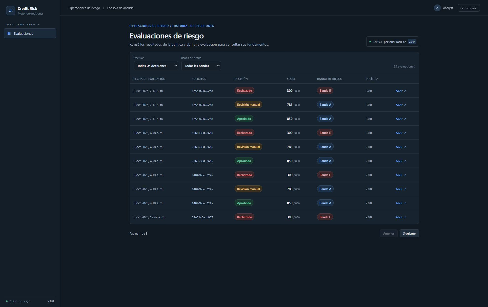
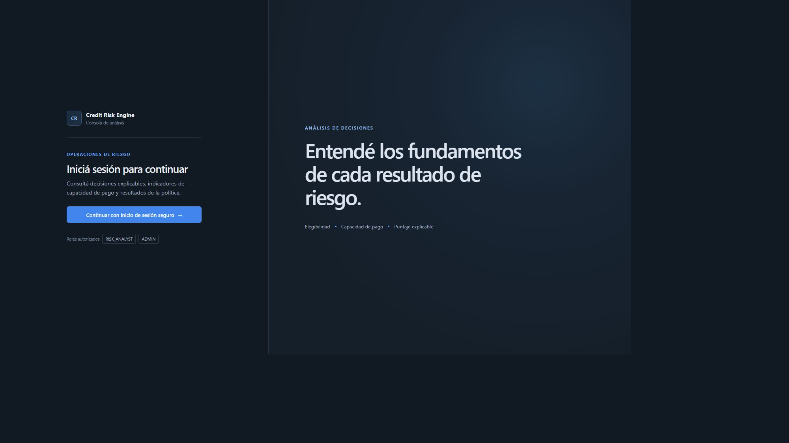
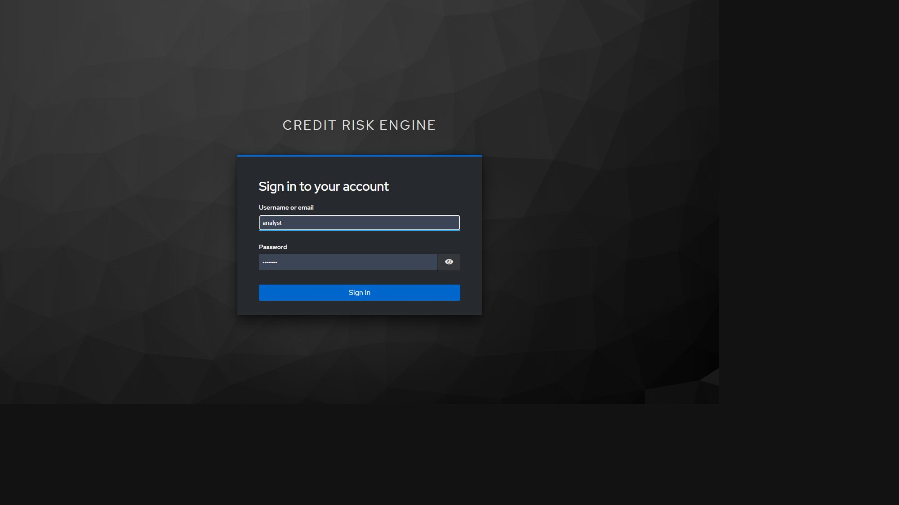
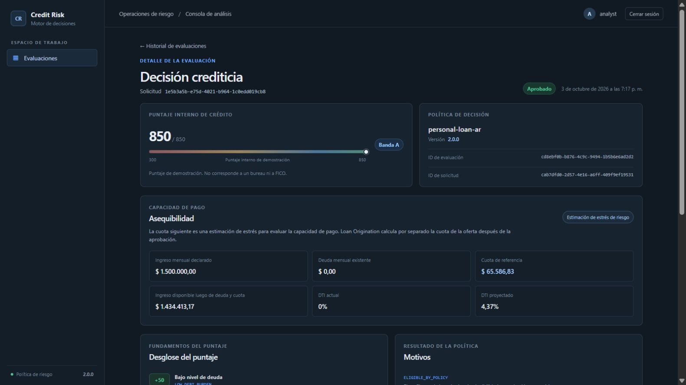
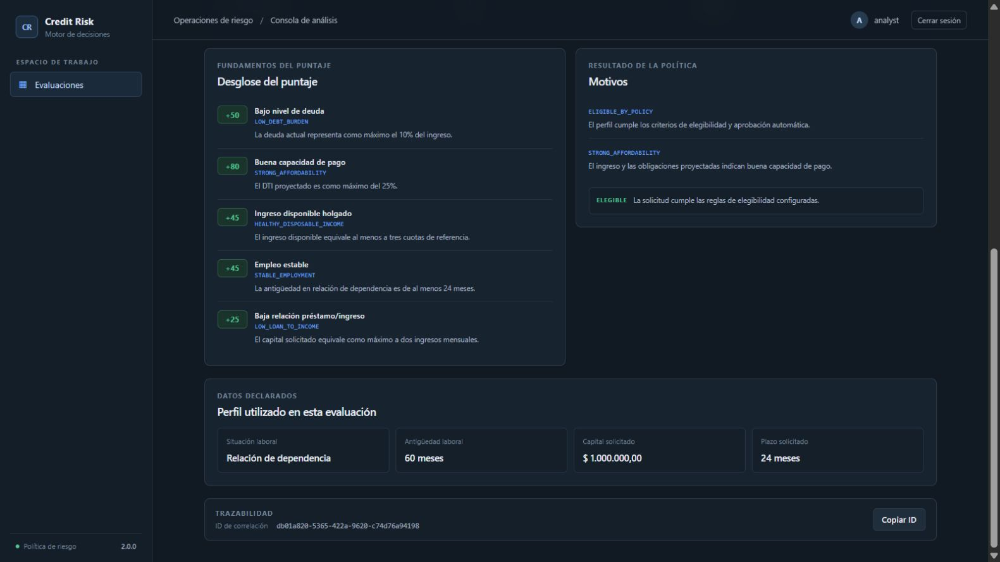
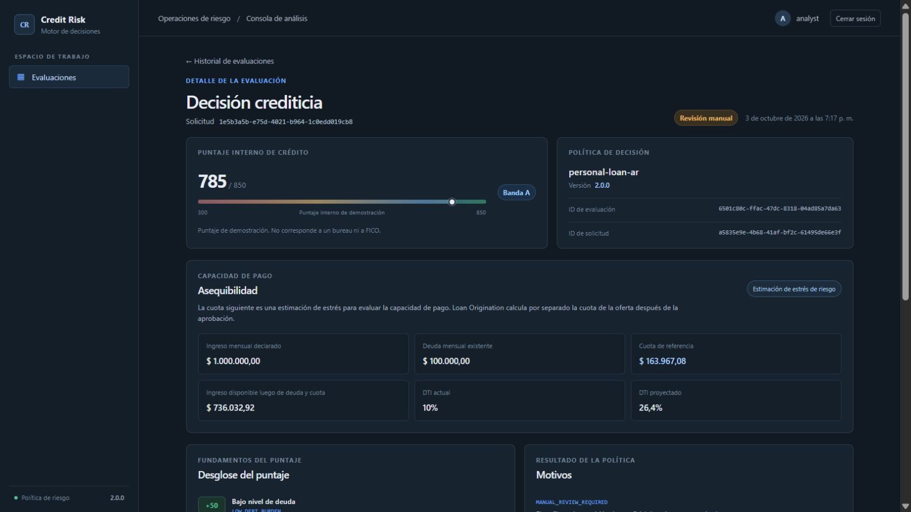
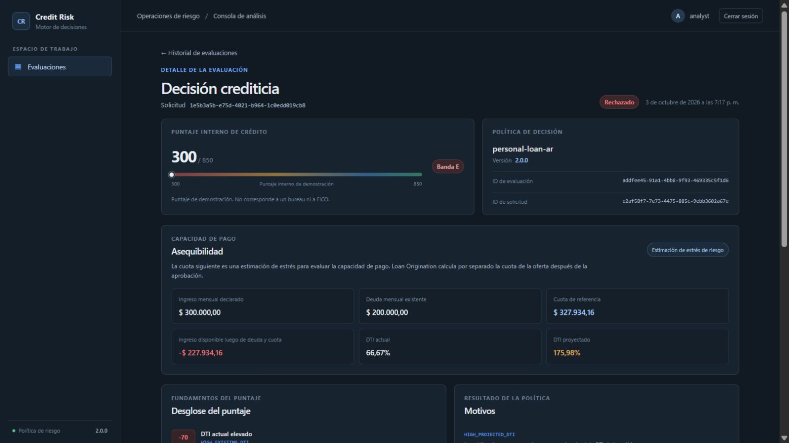
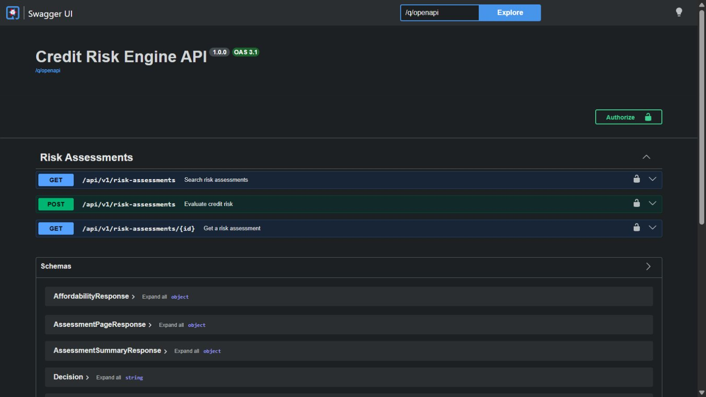
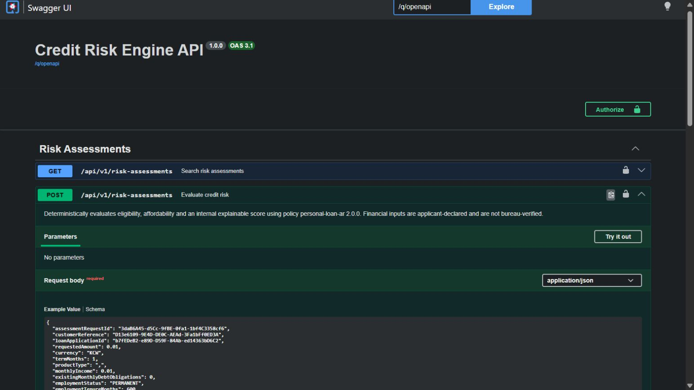

# Recorrido visual de Credit Risk Engine

[Índice](README.md) · [Backend](backend-walkthrough.md) · [Evidencia](evidence-2026-10-10.md)

Capturas reales del 10/10/2026. Cada pantalla está conectada a la API y PostgreSQL locales. Los registros eran preexistentes; los formularios y acciones de operación se muestran sin ejecutarlos. Las vistas de autenticación no contienen contraseñas ni tokens.

## 1. Consola del analista

**Rol:** RISK_ANALYST · **Ruta:** /assessments

23 evaluaciones existentes; paginación, decisión, banda y política permiten explorar el historial.

## 2. Acceso a la consola

**Rol:** PUBLIC · **Ruta:** /login

Entrada real de la SPA.

## 3. Realm independiente

**Rol:** PUBLIC · **Ruta:** /realms/credit-risk/protocol/openid-connect/auth

Keycloak credit-risk: autentica al analista sin compartir el realm del cliente LO. Formulario vacío.

## 4. Capacidad suficiente: APPROVE

**Rol:** RISK_ANALYST · **Ruta:** /assessments/cd8ebf0b-b876-4c9c-9494-1b5b6e6ad2d2

Score 850, banda A y DTI proyectado 4,37%. Capital ARS 1.000.000, plazo 24 meses, ingreso ARS 1.500.000 y empleo permanente.

## 5. Explicabilidad persistida

**Rol:** RISK_ANALYST · **Ruta:** /assessments/cd8ebf0b-b876-4c9c-9494-1b5b6e6ad2d2

Contribuciones, motivos, perfil evaluado y correlation ID. La explicación corresponde a la decisión guardada, no a un cálculo nuevo en React.

## 6. Buen score con revisión: REFER

**Rol:** RISK_ANALYST · **Ruta:** /assessments/6501c80c-ffac-47dc-8318-04ad85a7da63

Score 785 y banda A no bastan para aprobar: el fixture tiene empleo temporal con 2 meses de antigüedad. Ilustra que score y decisión son conceptos distintos.

## 7. Perfil rechazado por la política

**Rol:** RISK_ANALYST · **Ruta:** /assessments/addfee45-91a1-4bb8-9f93-469335c5f1d6

Resultado REJECT, score 300 y banda E. Es evaluación crediticia demostrativa, no verificación de un bureau ni de identidad.

## 8. API de evaluaciones

**Rol:** PUBLIC · **Ruta:** /q/swagger-ui

REST real para evaluar y consultar, con autorización RISK_ANALYST/ADMIN. No se ejecutó POST desde Swagger.

## 9. Entrada estructurada de riesgo

**Rol:** PUBLIC · **Ruta:** /q/swagger-ui

Schema generado del endpoint de evaluación. La validez del DTO y la elegibilidad de la política son validaciones diferentes.

## Cómo interpretar esta galería

Los IDs visibles corresponden a fixtures de desarrollo. No se afirma que todas las pantallas pertenezcan a la misma solicitud ni que el flujo haya sido ejecutado de cero en esta sesión. Swagger muestra el contrato generado; sus ejemplos son plantillas. Para pruebas ejecutadas, consultar la evidencia.
